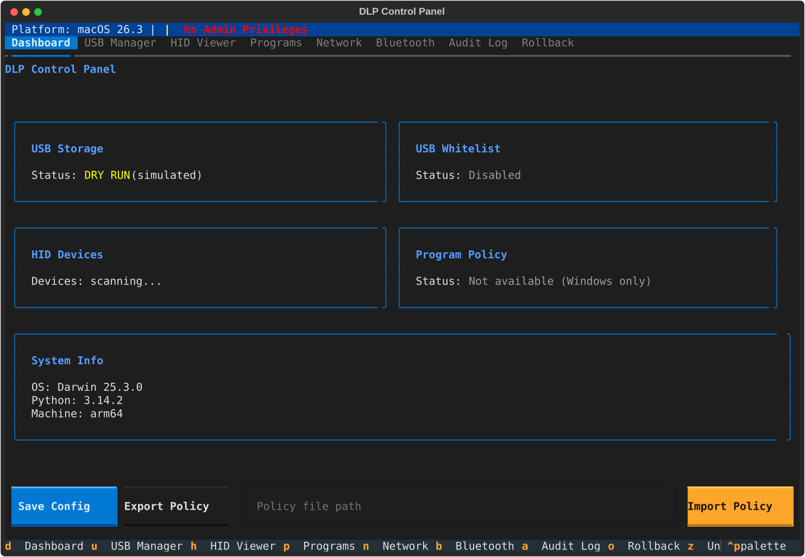
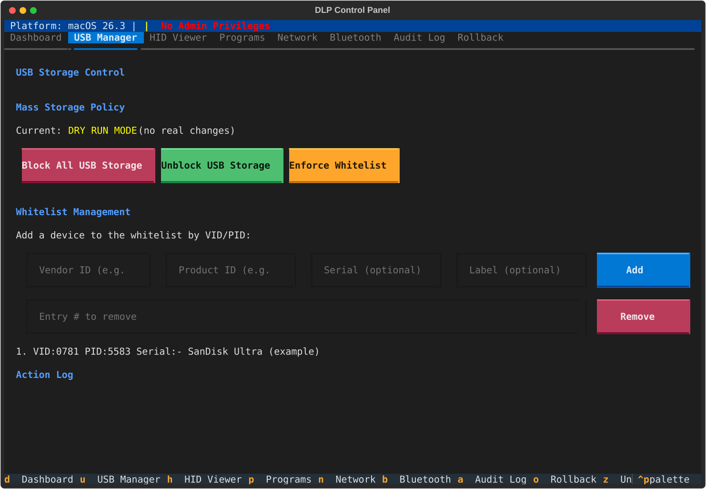
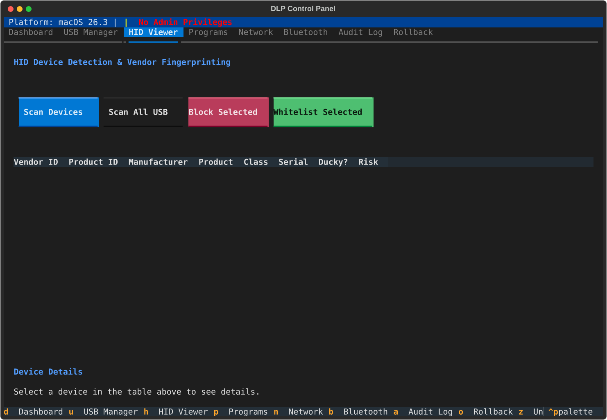
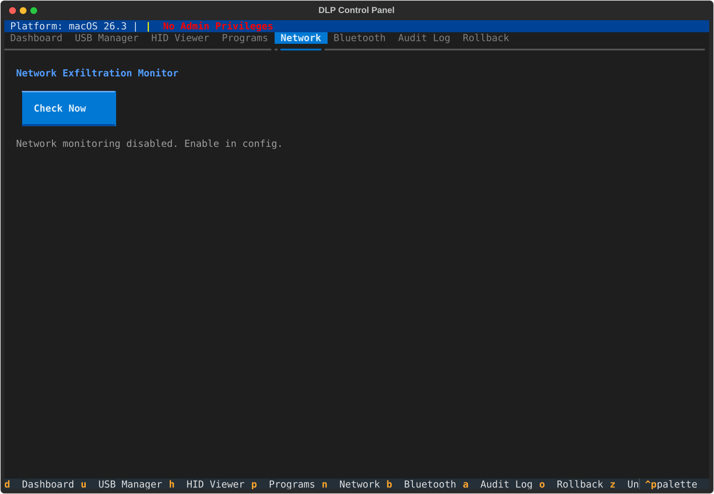

# dlp-tui

A terminal-based Data Loss Prevention (DLP) control panel built with [Textual](https://github.com/Textualize/textual). Monitor, restrict, and audit data exfiltration vectors — USB storage, HID devices, network uploads, Bluetooth, clipboard, and file activity — from a single keyboard-driven TUI.

Runs on **macOS**, **Windows**, and **Linux**. All destructive actions support dry-run mode, rollback, and structured audit logging.

## Screenshots

<p align="center">
  
</p>
<p align="center"><em>Dashboard — status overview with USB, whitelist, HID, and program policy cards</em></p>

<p align="center">
  
</p>
<p align="center"><em>USB Manager — block/unblock mass storage, manage device whitelist</em></p>

<p align="center">
  
</p>
<p align="center"><em>HID Viewer — scan and fingerprint USB HID devices, detect potential BadUSB</em></p>

<p align="center">
  
</p>
<p align="center"><em>Network Monitor — track upload volume per interface, alert on threshold breaches</em></p>

## Features

| Feature | Description | Platform |
|---------|-------------|----------|
| **USB Storage Blocking** | Block/unblock all USB mass storage globally | macOS, Windows, Linux |
| **USB Whitelist** | Allow specific devices by VID/PID/serial while blocking everything else | All |
| **HID Fingerprinting** | Scan HID devices and flag potential BadUSB/Rubber Ducky attacks | All |
| **Program Blocking** | Restrict program execution via Software Restriction Policies | Windows |
| **Network Monitoring** | Detect large uploads exceeding configurable thresholds | All |
| **Bluetooth Scanning** | Enumerate nearby Bluetooth devices | macOS, Linux |
| **Clipboard Monitoring** | Scan clipboard for sensitive patterns (SSN, credit cards, etc.) | All |
| **File Activity Monitoring** | Detect bulk file copies to external volumes | All |
| **Audit Logging** | Structured JSONL audit trail of all DLP actions | All |
| **Rollback** | Undo any action with a full rollback journal | All |
| **Policy Export/Import** | Save and load DLP policies as portable JSON files | All |
| **Desktop Notifications** | OS-native alerts for blocked USB insertion, BadUSB detection | All |
| **Hotplug Detection** | Automatic USB device change detection via polling | All |
| **Dry-Run Mode** | Simulate all actions without modifying the system | All |

## Keyboard Shortcuts

| Key | Action |
|-----|--------|
| `d` | Dashboard |
| `u` | USB Manager |
| `h` | HID Viewer |
| `p` | Program Policy |
| `n` | Network Monitor |
| `b` | Bluetooth |
| `a` | Audit Log |
| `o` | Rollback |
| `z` | Undo last action |
| `r` | Refresh all |
| `s` | Save config |
| `q` | Quit |

## Requirements

- Python 3.10+

## Installation

```bash
# Clone and set up a virtualenv
git clone <repo-url> && cd dlp-tui
python -m venv .venv && source .venv/bin/activate  # macOS/Linux
pip install -e .

# Windows extras (pywin32 + wmi)
pip install -e .[windows]
```

## Usage

```bash
# Run the TUI
dlp

# Or via module
python -m dlp

# Dry-run mode (no system changes)
dlp --dry-run
```

> Some features require elevated privileges (e.g. USB blocking needs `sudo` on macOS/Linux or Administrator on Windows).

## Development

```bash
pip install -e .[dev]
pytest
```

## Project Structure

```
src/dlp/
├── app.py                  # Main Textual application
├── config.py               # Pydantic config models (TOML-backed)
├── platform/               # OS-specific backends (macOS, Windows, Linux)
├── features/               # Feature controllers
│   ├── usb_block.py        #   USB storage blocking
│   ├── usb_whitelist.py    #   Device whitelist matching
│   ├── hid_fingerprint.py  #   BadUSB/Ducky detection
│   ├── program_block.py    #   Software restriction policies
│   ├── network_monitor.py  #   Upload threshold monitoring
│   ├── bluetooth_monitor.py#   Bluetooth enumeration
│   ├── clipboard_monitor.py#   Clipboard pattern scanning
│   ├── file_monitor.py     #   External volume file activity
│   ├── notifier.py         #   Desktop notifications
│   └── policy_export.py    #   Policy JSON export/import
├── audit/                  # Audit logging and rollback journal
└── ui/                     # Textual screens and widgets
    ├── screens/            #   Tab screens (dashboard, usb, hid, etc.)
    └── widgets/            #   Reusable widgets (status bar, confirm modal)
```

## License

See [pyproject.toml](pyproject.toml) for package metadata.
